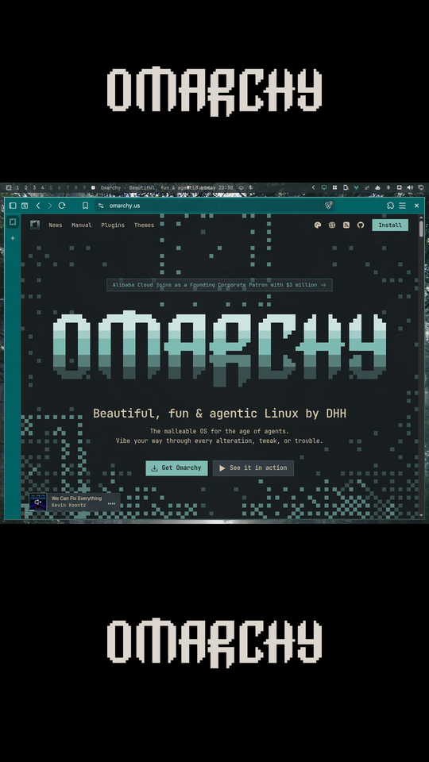
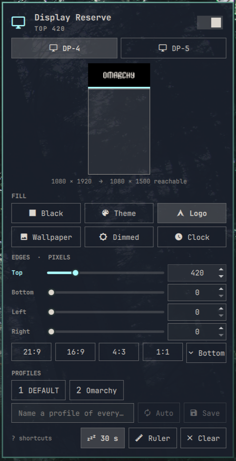

# Display Reserve for Omarchy

Blacks out display edges you can't reach (for example, the top of a tall
rotated monitor) and keeps the Omarchy bar and tiled windows in the area you
can reach.

<p align="center">
  
</p>

Requires Omarchy 4 with its Quickshell bar and shell plugins (tested on
4.0.4 with Hyprland 0.56).

## Install

```bash
omarchy plugin add https://github.com/mateuspim/omarchy-display-reserve.git --enable --yes
```

A monitor icon appears on the right of the bar. To put it elsewhere, run
`omarchy plugin enable pym.display-reserve --section left` (or `center`).

To update, pull the new version and restart the shell. The black edges stay
up while plugins reload, so the new version only takes over after a restart:

```bash
omarchy plugin update pym.display-reserve --yes && sleep 3 && omarchy restart shell
```

Keep the `sleep`: restarting while the shell is still reloading plugins can
crash the old shell on its way out. It comes back on its own, but there's no
reason to trigger it.

To uninstall, run `omarchy plugin remove pym.display-reserve`. Your saved
reservations stay in `~/.config/omarchy/display-reserve.json` until you
delete it.

## Usage

Click the monitor icon in the bar to open the panel. It edits the monitor the
bar is on; use the monitor buttons (or Tab) to switch. Changes apply live.

<p align="center">
  
</p>

- **Preview**: the monitor drawn to scale, with the black edges, the
  reachable area and where the bar will sit. Drag an edge to resize it
  (hold Ctrl for 1 px precision), or scroll over it (Shift: ×10).
- **Edge rows**: a slider for quick moves and a field for exact pixels.
  While you type in a field, keys go to the field; Enter, Esc or Tab
  applies the value and returns to the shortcuts below.
- **Aspect presets** (21:9, 16:9, 4:3, 1:1): reserve the edges that leave a
  reachable area of that shape. The button after them says where the area
  goes (Top, Center or Bottom on a portrait monitor, Left, Center or Right
  on a landscape one) and starts from the edges you have. A preset only
  reserves the pair of edges it cuts; on a portrait 1080×1920 monitor,
  16:9 at the bottom reserves the top 1312 px.
- **Fill**: what the reserved edges show on this monitor. **Black** is the
  default and the right choice for OLED panels. **Theme** uses the theme's
  background color. **Wallpaper** shows the slice of your wallpaper that
  would be there, so the desktop looks like it carries on into the edge;
  **Dimmed** darkens that slice, by 60% unless you move its **Dim**
  slider (10% to 90%). **Logo** puts the Omarchy logo, in the
  theme's text color, on black: the wordmark on the top and bottom edges,
  Omarchy's icon over it on the sides. **Clock** shows a 24-hour HH:MM clock
  in big blocky digits, in the theme's accent color, on one edge: the
  largest reserved edge, or with **Top or bottom** the larger of those two
  whenever either is reserved. The monitor's other edges stay black. The
  digits are always upright and as large as the edge allows: one line on a
  wide edge, hours over minutes on a tall one. Right-click a fill to give
  it to every monitor, with this monitor's dim amount and clock edge.
  Every fill except Black keeps something lit in the
  same place all day, which can burn into an OLED panel. The clock and the
  logo move a few pixels every 5 minutes to spread the wear. While the
  monitor shows a fullscreen window, every edge goes black whatever the fill.
- **Ruler**: draws a scale from the middle of every edge of the monitor to
  its middle, over everything: a tick every 10 px, a longer one every 50
  and the distance from that edge every 100. The tick marked N is the first
  line left on screen with N px reserved, so for an edge behind a bezel or
  another monitor, reserve about the first tick you can see. Closing the
  panel hides the ruler.
- **Idle** (the moon button): every edge on every monitor goes black after
  30 s, 1 min or 5 min without input, and back on the next input, whatever
  the fill. Off by default. An app that holds off the screensaver, such as a
  video player, holds this off too.
- **Profiles**: save every monitor as it is now (edges, fill, paused or
  not) under a name, such as "Desk" or "Gaming", and apply it later with
  one click or `1` to `9`. Applying one also puts its name in the name
  field, so after tweaking it, **Update** saves the changes over it. The
  profile that matches the screen is selected, and its name shows in the
  panel's title. Right-click a profile to delete it. Applying or deleting
  one can be undone. Black when idle is not part of a profile.
  With a profile's name in the field, **Auto** ties it to the monitors
  connected now: whenever exactly those monitors connect, such as when you
  dock, the profile applies by itself. One profile per set of monitors. A
  shell restart with the same monitors leaves your edits alone.
- **Switch**: pauses a monitor's reservation without forgetting the values.
  Right-clicking the bar icon does the same for the bar's monitor.
- **Clear**: removes every reserved edge on the monitor. Right after a
  Clear, or zeroing an edge, the button turns into **Undo**.

Values are in logical pixels. On a scaled monitor the panel shows the scale
next to the edges, since a ruler on the screen measures something else.

| Key | Action |
| --- | --- |
| `j` / `k`, ↓ / ↑ | Select an edge |
| `h` / `l`, ← / → | Shrink or grow it by 10 px (Shift: 100, Ctrl: 1) |
| `0`, Backspace, Delete | Zero the selected edge |
| `u`, Ctrl+Z | Undo a Clear, a zeroed edge, a preset or a profile change |
| Space, `p` | Pause or resume the monitor |
| `f` | Next fill |
| `c` | Clock on the largest edge / top or bottom |
| `a` | Move the reachable area of an aspect preset |
| `r` | Show or hide the ruler |
| `i` | Black when idle: off, 30 s, 1 min, 5 min |
| `1` – `9` | Apply a profile |
| `s` | Name a profile to save (Enter saves it) |
| Tab / Shift+Tab | Next or previous monitor |
| `?` | Show or hide these shortcuts in the panel |
| Esc, `q` | Close (Esc closes the shortcut sheet first) |

Opposite edges share a budget: together, top and bottom (or left and right)
can reserve at most 90% of the screen, so the bar and the panel always have
room. Values over the budget, for example from a hand edit or after a
monitor switches to a smaller mode, are trimmed when drawn.

## Keybinds and scripts

The shell answers IPC calls on the target `pym.display-reserve`, through
`omarchy-shell`. For the calls that take one, the first argument names the monitor: a connector such as
`DP-4`, `""` or `focused` for the focused monitor, or `all`.

| Call | Does |
| --- | --- |
| `status` | Every monitor's settings, as JSON |
| `toggle <monitor>` | Pause or resume |
| `pause <monitor>`, `resume <monitor>` | Pause, resume |
| `fill <monitor> <fill>` | Set the fill: `black`, `theme`, `logo`, `wallpaper`, `dim` or `clock` |
| `nextFill <monitor>` | Next fill, as `f` in the panel |
| `dim <monitor> <percent>` | How dark the dimmed fill is, 10 to 90 |
| `edge <monitor> <side> <pixels>` | Reserve `pixels` on `top`, `bottom`, `left` or `right` |
| `aspect <monitor> <ratio> <place>` | An aspect preset: `16:9`, `4:3`, any `w:h`; `top`, `left`, `center`, `bottom`, `right`, or `""` to keep the current place |
| `ruler <monitor>` | Show or hide the ruler |
| `idle <seconds>` | Black when idle after `seconds`; `0` turns it off |
| `profile <name>` | Apply a profile to every monitor |
| `saveProfile <name>` | Save every monitor as profile `name`, replacing one of that name |
| `deleteProfile <name>` | Delete a profile |
| `autoProfile <name> <on\|off>` | Apply a profile by itself whenever the monitors connected now connect, or stop |
| `profiles` | List the profiles, the one on screen marked `*` |

For example, from a terminal:

```bash
omarchy-shell pym.display-reserve fill DP-4 clock
omarchy-shell pym.display-reserve aspect DP-4 16:9 bottom
omarchy-shell pym.display-reserve profile Gaming
```

Profile names are matched ignoring case.

To pause the focused monitor with Super+Alt+P and cycle its fill with
Super+Alt+Shift+P, add to `~/.config/hypr/bindings.lua`:

```lua
o.bind("SUPER + ALT + P", "Pause display reserve", "omarchy-shell pym.display-reserve toggle focused")
o.bind("SUPER + ALT + SHIFT + P", "Next reserve fill", "omarchy-shell pym.display-reserve nextFill focused")
```

## How it works

Each reserved edge gets two layer-shell surfaces:

| Surface | Layer | Purpose |
| --- | --- | --- |
| `pym-display-reserve-spacer` | Bottom | Reserves the edge with an exclusive zone. Hyprland lays out exclusive zones from the lowest layer up, so this claims the edge before the Top-layer bar, which lands just inside the reachable area with tiled windows after it. |
| `pym-display-reserve` | Overlay | A strip in the monitor's fill that blocks the pointer and covers anything that strays into the reserved area. |

While the ruler is up, a click-through `pym-display-reserve-ruler` surface
covers its monitor on the Overlay layer.

Fullscreen windows ignore exclusive zones, so on a monitor with a reserve
the plugin fits them to the reachable area instead: when a window goes
fullscreen there, it switches it to Hyprland's fullscreen state `1 2`,
maximized for Hyprland (which keeps it inside the reserve) and still
fullscreen for the app, the way a browser's fullscreen fills only its
window. Leaving fullscreen works as usual (`Super+F`, Esc, the app's own
button). A game in fullscreen gets the reachable area's size too.

The wallpaper and dimmed fills draw the image that
`~/.local/state/omarchy/current/background` points to, scaled and cropped
the way Omarchy's background layer does it. While any monitor uses one of
them, the link is checked every 2 seconds, so after a wallpaper or theme
change the edges can show the old image for up to 2 seconds.

The plugin never edits `~/.config/hypr/monitors.lua` or runs
`hyprctl reload`.

### Saved settings

Reservations are stored in `~/.config/omarchy/display-reserve.json`, keyed
by the monitor's Hyprland description (make, model and serial, as in
`hyprctl monitors`), so they follow the monitor when a dock renumbers its
connectors:

```json
{ "outputs": { "Dell Inc. DELL U2720Q 1A2B3C4": { "enabled": true, "top": 350, "bottom": 0, "left": 0, "right": 0 } } }
```

A monitor with no description, or one that shares its description with
another connected monitor, is keyed by its connector name (`DP-4`) instead.
Each entry also has `enabled`, which is `false` while the monitor is paused,
and can have `fill`: `"black"` (the default), `"theme"`, `"wallpaper"`,
`"dim"`, `"logo"` or `"clock"`, `clockEdge`: `"largest"` (the default)
or `"topBottom"`, and `dim`: the dimmed fill's percent (60 by default).
Clear keeps the fill. Black when idle is one setting for every monitor,
stored beside `outputs` as `"idleBlack"`: seconds, left out while it is
off. Profiles are stored beside them as `"profiles"`, each a copy of
`outputs` under its name; applying one makes `outputs` exactly that copy.
`"autoProfiles"` maps a profile's name to the monitor keys it applies with,
and `"monitors"` holds the keys connected last, so the plugin can tell a
new set of monitors from a restart.

The file is watched, so hand edits apply right away. An edit made within
200 ms of a change in the panel is overwritten by that change.

## Known limitations

- Omarchy's own popouts (clock, audio and others) assume the bar sits at the
  screen edge, so on a monitor with a reserved edge on the bar's side they
  open inside the black strip. This plugin's own panel opens beside the bar.
